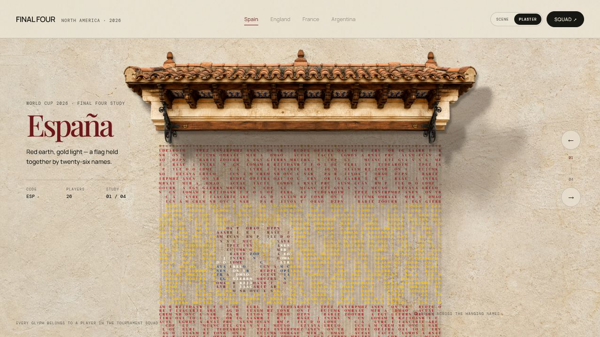

# 四强字母旗 · Final Four Typographic Flags

> 用 **2026 世界杯四强** 26 人大名单的字母悬挂而成的字符帘幕互动装置。
>
> 简体中文本地化版 · fork 自 [amirmushichge/world-cup-letter-flags](https://github.com/amirmushichge/world-cup-letter-flags)

非官方球迷项目, 不代表 FIFA、赛事主办方或任何足协立场。

四支半决四强 —— **西班牙 · 英格兰 · 法国 · 阿根廷**, 每一面旗子都由本国 26 人大名单的字母组成。

字母悬挂在独立模拟的绳索上; 用鼠标或手指刷过它们, 冲量会沿弦向下传导, 随后在重力下摆动归位。

## 技术架构

- **Vite 7** · 纯 vanilla JS, 无框架无 TS
- **Verlet 弦物理** —— 每列字母 = 一条 pinned 顶端的粒子链, 5 次距离约束迭代, 保留弹性形变
- **Canvas 2D** 逐帧 `fillText` (字母总数约 104 个, 无需 atlas)
- **HTMLAudioElement** 手势阈值触发解说词槽位
- WebP 建筑穹顶素材 (AI 生成 → 手工抠边)

## 本地化改动

- UI 全站中文化 (index.html · 按钮 · aria-label · 面板 · 元信息)
- 数据层中文化 (国家诗句 · 建筑说明 · 解说词 · 球员位置 · 名单来源标签)
- **保留原文**:
  - 球员姓名 (西/英/法/阿护照名 —— 是字母帘幕的原料, 换译名会破坏)
  - 国家显示名 (`localName`: España / England / France / Argentina —— 尊重原始语言)
  - 音频文件名与 URL

## 本地运行

需要 Node.js 22+ 或 Bun 1.2+:

\`\`\`bash
bun install
bun run dev
\`\`\`

## 音频

仓库不附带受版权保护的比赛解说音频。项目预留了本地文件槽位, 见原始 [`public/audio/README.md`](public/audio/README.md)。

## 许可

代码与项目内生成的视觉素材遵循 MIT 协议。比赛解说音频**故意不包含**在仓库内。

## 致谢

- 原作者: [@youraipulse](https://x.com/youraipulse) · [@AmirMushich](https://x.com/AmirMushich)
- 灵感: [@marina_uiux](https://x.com/marina_uiux) (kinetic typography 家族)
- 简体中文本地化: gandli
